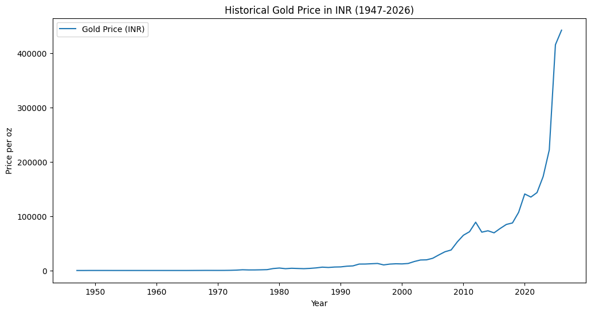
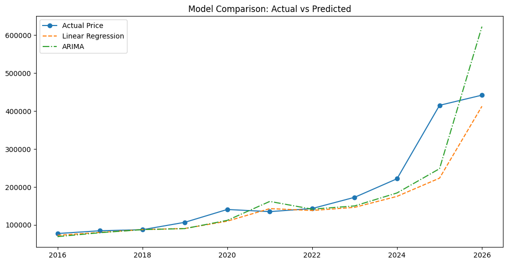

# 📈 Gold Price Analysis using Python

## 📌 Overview

This project presents an Exploratory Data Analysis (EDA) and predictive analysis of historical gold prices from **1947 to 2026**. The objective is to understand long-term price trends, analyze historical patterns, and compare actual values with model predictions using Python-based data analysis and visualization techniques.

The project demonstrates practical applications of data preprocessing, visualization, and predictive modeling, making it a comprehensive example of data analytics using Python.

---

## 🚀 Project Objectives

- Analyze historical gold price trends
- Perform Exploratory Data Analysis (EDA)
- Visualize long-term price movements
- Build a predictive model for gold price forecasting
- Compare actual values with predicted values

---

## 🛠️ Technologies Used

- Python
- Pandas
- NumPy
- Matplotlib
- Scikit-learn
- Google Colab

---

## 📂 Repository Contents

| File | Description |
|------|-------------|
| `Gold_Price_Analysis.ipynb` | Complete project notebook containing data preprocessing, visualization, and predictive analysis |
| `gold_prices_1947_2026_INR.csv` | Historical gold price dataset (1947–2026) |
| `Gold_Price_Prediction_Report.docx` | Project report with methodology and findings |
| `gold_price_trend.png` | Historical gold price trend visualization |
| `model_comparison.png` | Comparison of actual and predicted gold prices |

---

# 📊 Visualizations

## Historical Gold Price Trend

---

## Actual vs Predicted Gold Price

---

## 📈 Key Insights

- Historical gold prices have shown a strong upward trend over the decades.
- Exploratory Data Analysis helped identify long-term market patterns.
- Predictive modeling demonstrates how machine learning can be applied to financial datasets.
- The comparison between actual and predicted values provides insights into model performance.

---

## 📁 Dataset

The dataset contains historical gold price information from **1947–2026**, including yearly gold prices in INR.

---

## 📄 Project Report

A detailed report explaining the project's methodology, implementation, visualizations, and findings is included in this repository.

---

## 🌟 Future Enhancements

- Implement advanced regression models
- Integrate LSTM for time-series forecasting
- Build an interactive dashboard using Power BI or Streamlit
- Deploy the model as a web application

---

## 👩‍💻 Author

**Ashvika Verma**

B.Tech – Computer Science & Engineering (Data Science)

Interested in Data Analytics, Machine Learning, Artificial Intelligence, and Software Development.

---

⭐ If you found this project interesting, feel free to star the repository!
